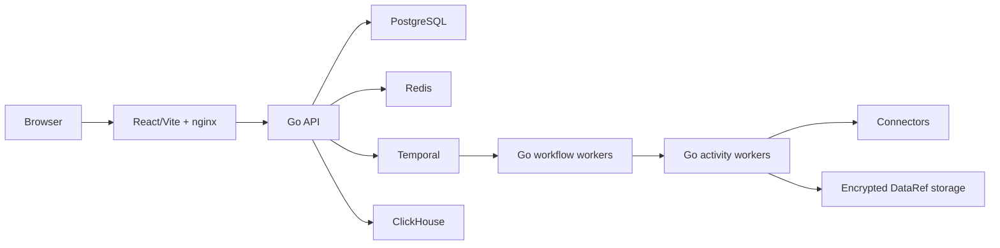

<div align="center">
  <h1>DataFlow</h1>
  <p><strong>Visual, durable data pipelines powered by Go and Temporal</strong></p>
</div>

DataFlow is an Apache-2.0 open-core data-pipeline platform in pre-release demo
stage. A React/Vite editor creates versioned DAGs; Go API and workers execute
them durably through Temporal. PostgreSQL stores tenant and pipeline state,
Redis carries bounded events/rate limits, ClickHouse serves analytics, and
encrypted `DataRef` objects move larger payloads outside workflow history.

## Current status

Good fit: local development, controlled product demos, architecture and
connector validation.

Not yet claimed: production readiness, HA, 10K/1M-DAG capacity, SOC 2/ISO 27001
compliance, or penetration-test assurance. Release blockers and acceptance
criteria are explicit in the [roadmap](docs/ROADMAP.md) and
[pre-release audit](docs/audit/2026-07-10-pre-release-audit.md).

## Features

- React Flow canvas with Mermaid round-trip editing and local Ollama drafting.
- Immutable pipeline versions, Integration/Production lifecycle, backfills,
  pause/resume/cancel, and Temporal retries.
- Manifest-driven HTTP connectors plus coded database, SaaS, file, Kafka,
  Snowflake, ClickHouse, Iceberg, SFTP, Google, Microsoft, and Zendesk paths.
- Cursor/CDC checkpoints, dedupe state, data contracts, lineage, quality,
  alerts, analytics dashboards, and OpenLineage import/export.
- Tenant-aware PostgreSQL RLS, encrypted credentials/payloads, audit events,
  and owner/member workspace access.

## Architecture



The backend remains a modular monolith with three independently scalable
processes. Microservice and micro-frontend extraction seams are documented in
[Architecture](docs/ARCHITECTURE.md); premature network splits are deliberate
non-goals.

## Quick start

Requirements: Docker Desktop with at least 8 GB RAM, Node.js 20+, Kind,
`kubectl`, and Helm.

```bash
./scripts/bootstrap.sh
./scripts/smoke-test.sh
```

Open `http://localhost:3002`. Bootstrap generates local secrets and installs
the full Kind/Helm stack. See [Local setup](docs/SETUP.md) for development and
test commands.

## Live demo host

Current GCE demo box (IP rotates when the VM is recreated — repoint the
`dataflow` A record in the `cohestra.dev` DNS zone if that happens):

- App: https://dataflow.cohestra.dev
- Deploy: `sudo git pull --ff-only`, rebuild `dataflow-app:local` /
  `dataflow-web:local` images, `sudo kind load docker-image --name dataflow `
  for both, then `kubectl rollout restart deploy/api deploy/web -n dataflow`
  (~10-15 min). See [GCP deployment](docs/DEPLOYMENT_GCP.md) for a fresh
  Terraform-provisioned host — `appUrl` derives from the reserved static IP,
  so it changes per deployment.

## Using DataFlow: build and run a pipeline

1. Open the app, sign in, land on the pipeline canvas.
2. Drag a source node from the palette (any connector in the catalog) onto
   the canvas, configure its fields (URL, auth, filters).
3. Drag a sink node, connect source → sink (add transforms in between as
   needed). Or describe the pipeline in the AI builder box and let it draft
   the graph, then edit by hand.
4. Save — this creates an immutable pipeline version.
5. Promote through the lifecycle: Integration (test run) → Production.
6. Run manually, or let Temporal schedule/trigger it; watch progress, retries,
   and backfills from the run view.
7. Check Lineage, Data Quality, and Analytics tabs for output visibility and
   OpenLineage export.

## Registering a new connector

Two paths, see [Connector development](docs/CONNECTORS.md) for full detail:

- **No-code (REST/HTTP source):** drop a `*.manifest.json` file into
  `connectors/manifests/` (bundled) or a directory pointed to by
  `CONNECTORS_DIR` (no rebuild — restart worker + API). It auto-appears in
  the catalog, canvas palette, and AI builder. Example:

  ```json
  {
    "activityType": "rest.jsonplaceholder.fetch",
    "label": "JSONPlaceholder (demo REST)",
    "kind": "source",
    "url": "https://jsonplaceholder.typicode.com/posts",
    "method": "GET",
    "pagination": { "style": "page", "param": "_page", "limitParam": "_limit", "limit": 20 }
  }
  ```

- **Coded (OAuth, GraphQL, SDK auth, changes-feeds):** register a Go source/
  sink in `apps/workflow-go/internal/connectors/`, then add catalog metadata
  on the frontend if it needs canvas config fields.

## Demo video

<!-- Record a walkthrough (build → deploy → run → lineage/analytics), upload
to YouTube, then replace this line with the link. -->

[Watch on YouTube](TODO-add-youtube-link-here)

## Repository layout

| Path | Purpose |
| --- | --- |
| `apps/workflow-go` | Go API, Temporal workflow/activity workers, connectors, storage |
| `apps/web` | React UI, route features, design components, deployed E2E tests |
| `packages/shared` | Browser pipeline/Mermaid/lineage contracts |
| `cohestra` | Compute control plane for Flink/Spark execution |
| `connectors/manifests` | Declarative connector plugins |
| `db` | PostgreSQL and ClickHouse migrations |
| `deploy` | Kind and Helm demo deployment |
| `infra` | GCP demo infrastructure |
| `docs` | Canonical architecture, operations, security, roadmap, audits |
| `tests` | Cross-runtime contracts and benchmarks |

## Documentation

- [Documentation index](docs/README.md)
- [Architecture](docs/ARCHITECTURE.md)
- [GCP deployment and persistence](docs/DEPLOYMENT_GCP.md)
- [Security and compliance readiness](docs/SECURITY_COMPLIANCE.md)
- [Pending roadmap](docs/ROADMAP.md)
- [Backend contracts](docs/BACKEND_CONTRACTS.md)
- [Connector development](docs/CONNECTORS.md)

## Contributing and security

Read [CONTRIBUTING.md](CONTRIBUTING.md), [CODE_OF_CONDUCT.md](CODE_OF_CONDUCT.md),
and [GOVERNANCE.md](GOVERNANCE.md). Report vulnerabilities privately using
[SECURITY.md](SECURITY.md). Never commit `.env`, secret files, DB dumps,
Terraform state, or generated credential values.

Licensed under the [GNU AGPL-3.0](LICENSE), except
[`apps/workflow-go/ee/`](apps/workflow-go/ee/) — the enterprise features
(Flink SQL, Spark SQL, realtime stream-direct) — which is source-available
under the [Elastic License 2.0](apps/workflow-go/ee/LICENSE). Community builds
(`go build ./...`) exclude `ee/` entirely; enterprise builds use
`go build -tags ee ./...`.
