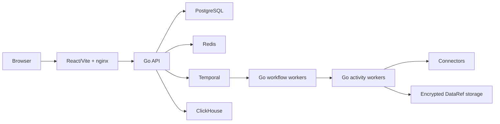

<div align="center">
  <h1>DataFlow</h1>
  <p><strong>Visual, durable data pipelines powered by Go and Temporal</strong></p>
</div>

DataFlow is an Apache-2.0 open-core data-pipeline platform in pre-release demo
stage. A React/Vite editor creates versioned DAGs; Go API and workers execute
them durably through Temporal. PostgreSQL stores tenant and pipeline state,
Redis carries bounded events/rate limits, ClickHouse serves analytics, and
encrypted `DataRef` objects move larger payloads outside workflow history.

## Current status

Good fit: local development, controlled product demos, architecture and
connector validation.

Not yet claimed: production readiness, HA, 10K/1M-DAG capacity, SOC 2/ISO 27001
compliance, or penetration-test assurance. Release blockers and acceptance
criteria are explicit in the [roadmap](docs/ROADMAP.md) and
[pre-release audit](docs/audit/2026-07-10-pre-release-audit.md).

## Features

- React Flow canvas with Mermaid round-trip editing and local Ollama drafting.
- Immutable pipeline versions, Integration/Production lifecycle, backfills,
  pause/resume/cancel, and Temporal retries.
- Manifest-driven HTTP connectors plus coded database, SaaS, file, Kafka,
  Snowflake, ClickHouse, Iceberg, SFTP, Google, Microsoft, and Zendesk paths.
- Cursor/CDC checkpoints, dedupe state, data contracts, lineage, quality,
  alerts, analytics dashboards, and OpenLineage import/export.
- Tenant-aware PostgreSQL RLS, encrypted credentials/payloads, audit events,
  and owner/member workspace access.

## Architecture



The backend remains a modular monolith with three independently scalable
processes. Microservice and micro-frontend extraction seams are documented in
[Architecture](docs/ARCHITECTURE.md); premature network splits are deliberate
non-goals.

## Quick start

Requirements: Docker Desktop with at least 8 GB RAM, Node.js 20+, Kind,
`kubectl`, and Helm.

```bash
./scripts/bootstrap.sh
./scripts/smoke-test.sh
```

Open `http://localhost:3002`. Bootstrap generates local secrets and installs
the full Kind/Helm stack. See [Local setup](docs/SETUP.md) for development and
test commands.

## Repository layout

| Path | Purpose |
| --- | --- |
| `apps/workflow-go` | Go API, Temporal workflow/activity workers, connectors, storage |
| `apps/web` | React UI, route features, design components, deployed E2E tests |
| `packages/shared` | Browser pipeline/Mermaid/lineage contracts |
| `cohestra` | Compute control plane for Flink/Spark execution |
| `connectors/manifests` | Declarative connector plugins |
| `db` | PostgreSQL and ClickHouse migrations |
| `deploy` | Kind and Helm demo deployment |
| `infra` | GCP demo infrastructure |
| `docs` | Canonical architecture, operations, security, roadmap, audits |
| `tests` | Cross-runtime contracts and benchmarks |

## Documentation

- [Documentation index](docs/README.md)
- [Architecture](docs/ARCHITECTURE.md)
- [GCP deployment and persistence](docs/DEPLOYMENT_GCP.md)
- [Security and compliance readiness](docs/SECURITY_COMPLIANCE.md)
- [Pending roadmap](docs/ROADMAP.md)
- [Backend contracts](docs/BACKEND_CONTRACTS.md)
- [Connector development](docs/CONNECTORS.md)

## Contributing and security

Read [CONTRIBUTING.md](CONTRIBUTING.md), [CODE_OF_CONDUCT.md](CODE_OF_CONDUCT.md),
and [GOVERNANCE.md](GOVERNANCE.md). Report vulnerabilities privately using
[SECURITY.md](SECURITY.md). Never commit `.env`, secret files, DB dumps,
Terraform state, or generated credential values.

Licensed under the [Apache License 2.0](LICENSE).
