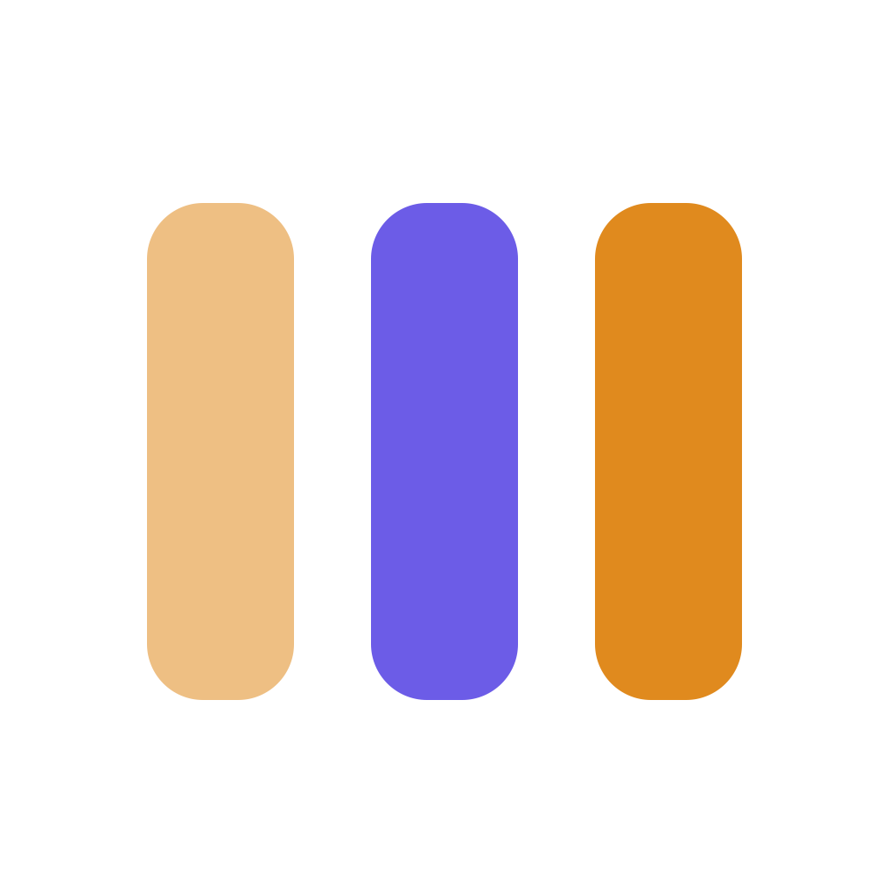

<div align="center">
  
  <h1>Cohestra DataFlow</h1>
  <p><strong>Visual, durable data pipelines powered by Go and Temporal.</strong></p>
  <p>
    <a href="https://dataflow.cohestra.dev">Open DataFlow</a> ·
    <a href="https://cohestra.dev/docs/dataflow">Documentation</a> ·
    <a href="https://cohestra.dev/docs/dataflow/setup">Self-hosting</a>
  </p>
</div>

DataFlow is an open-core platform for building, running, and observing data
pipelines. Use the visual canvas or AI-assisted builder, promote immutable
versions between environments, and let Temporal resume work safely after
failures.

The community code is licensed under **GNU AGPL-3.0**. Enterprise-only code in
`apps/workflow-go/ee/` is source-available under **Elastic License 2.0**.

> DataFlow is pre-release software. It is suitable for local evaluation and
> controlled pilots; production readiness and high availability depend on your
> deployment and backing services.

## Get started

Try the hosted app at [dataflow.cohestra.dev](https://dataflow.cohestra.dev), or
run it locally with Docker Compose:

```bash
git clone https://github.com/Cohestra/cohestra-dataflow.git
cd cohestra-dataflow
cp .env.example .env
node scripts/gen-worker-keypair.js
docker compose up -d
```

Open `http://localhost:3002`. For local Kubernetes, an existing cluster, or a
GCP/Terraform deployment, use the [self-hosting guide](https://cohestra.dev/docs/dataflow/setup).

## What is included

- Visual pipeline canvas and AI-assisted pipeline drafting.
- Durable execution, retries, schedules, backfills, pause, resume, and cancel.
- Immutable versions with Integration and Production promotion gates.
- Runtime lineage, data quality, alerts, analytics, audit events, and OpenLineage.
- **13 built-in sources and 12 built-in sinks**, with saved credentials and
  OAuth where supported.
- Tenant-aware PostgreSQL row-level security and encrypted credentials and
  payloads.

## Architecture

| Layer | Components | Responsibility |
| --- | --- | --- |
| Experience | React/Vite web app | Canvas, catalog, runs, lineage, and administration |
| API | Go API | Identity, tenants, pipeline lifecycle, run control, monitoring, and billing |
| Orchestration | Temporal + Go workflow workers | Durable DAG history, queues, retries, timers, and signals |
| Data plane | Go activity workers | Connector I/O, checkpoints, payload handling, and sink writes |
| State | PostgreSQL, Redis, ClickHouse, object storage | Authoritative metadata, events, analytics, and encrypted large payloads |

See the [visual architecture guide](https://cohestra.dev/docs/dataflow/architecture)
for the full runtime flow.

## Connect data

Open **Connectors** in DataFlow, save a connection, test it, and select that
connection from a source or sink node. The authenticated REST API can also be
used from `fetch`, `curl`, or any HTTP client library. No product source changes
or image rebuilds are required.

See the [connector catalog and API examples](https://cohestra.dev/docs/dataflow/connectors).

## Repository structure

| Path | Purpose |
| --- | --- |
| `apps/web` | React application, routes, and UI components |
| `apps/workflow-go` | Go API, Temporal workers, connector runtime, and storage |
| `packages/shared` | Shared pipeline, catalog, lineage, and entitlement contracts |
| `connectors/manifests` | Deploy-time declarative connector manifests |
| `db` | PostgreSQL and ClickHouse migrations |
| `deploy/helm/dataflow` | Kubernetes Helm chart |
| `infra` | Optional Terraform deployment reference |
| `docs` | Architecture, operations, security, API contracts, and decisions |
| `tests` | Cross-runtime contracts and deployment verification |

## Documentation

| Guide | Use it for |
| --- | --- |
| [Documentation home](https://cohestra.dev/docs/dataflow) | User-facing documentation index |
| [Architecture](https://cohestra.dev/docs/dataflow/architecture) | Runtime flow, process boundaries, and data ownership |
| [Self-hosting](https://cohestra.dev/docs/dataflow/setup) | Docker, Kubernetes/Helm, and GCP/Terraform |
| [Connectors](https://cohestra.dev/docs/dataflow/connectors) | Supported sources and sinks, UI setup, and API use |
| [Backend contracts](docs/BACKEND_CONTRACTS.md) | HTTP and Temporal compatibility surface |
| [Security](docs/SECURITY_COMPLIANCE.md) | Security baseline and release controls |
| [Roadmap](docs/ROADMAP.md) | Pending work and acceptance criteria |

## Contributing, security, and license

Read [CONTRIBUTING.md](CONTRIBUTING.md), [CODE_OF_CONDUCT.md](CODE_OF_CONDUCT.md),
and [GOVERNANCE.md](GOVERNANCE.md). Report vulnerabilities privately using
[SECURITY.md](SECURITY.md).

- Community code: [GNU AGPL-3.0](LICENSE)
- Enterprise directory: [Elastic License 2.0](apps/workflow-go/ee/LICENSE)
- Required notices: [NOTICE](NOTICE)
