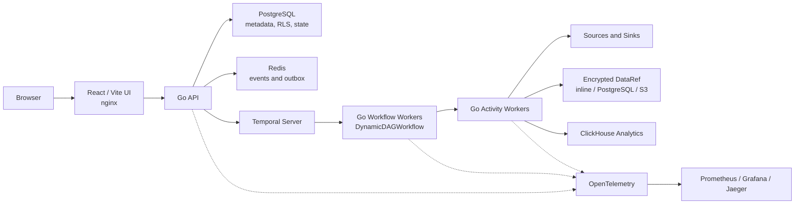

<div align="center">
  <h1>DataFlow</h1>
  <p><strong>Visual, durable data pipelines powered by Go and Temporal</strong></p>

  <p>
    <a href="LICENSE"></a>
    
    
    
  </p>

  <p>
    Build pipelines on a React Flow canvas or draft them from natural language<br/>
    with a local Ollama model. Run them on a Go backend with durable execution.
  </p>
</div>

---

DataFlow is an **Apache 2.0-licensed**, open-core data pipeline POC. It combines
visual and Mermaid-based authoring, pluggable connectors, test and production
environments, lineage, monitoring, and encrypted payload storage in one local
Docker Compose stack.

The backend is entirely Go: one module builds the API, Temporal workflow worker,
and activity worker. React/Vite remains the frontend. Public REST contracts,
Temporal names and queues, connector manifests, and AES-256-GCM payload formats
are documented and kept stable.

## Key Features

- **Visual and AI authoring** — React Flow and Mermaid stay synchronized; an
  optional local Ollama model can draft pipeline definitions.
- **Durable execution** — Temporal provides retries, pause/resume/cancel,
  schedules, crash-safe backfills, and deterministic workflow replay.
- **Pluggable data plane** — built-in database, file, SaaS, Kafka, Snowflake,
  Iceberg, and manifest-driven HTTP connectors.
- **Incremental state** — cursors, CDC offsets, dedupe state, and execution
  completion commit only after the full DAG succeeds.
- **Encrypted payloads** — inline, PostgreSQL, or S3-compatible `DataRef` storage
  uses AES-256-GCM encryption.
- **Operational visibility** — lineage, execution monitoring, alerts, audit data,
  Prometheus metrics, Grafana dashboards, and Jaeger traces.

## Architecture



The UI emits an immutable `PipelineDefinition`. The API stores a version and
registers its cron, webhook, or event trigger. Each firing starts
`DynamicDAGWorkflow`; workflow workers poll `dynamic-dag-<env>` and activity
workers poll `dynamic-activities-<env>`. The workflow runs independent DAG nodes
in parallel while the activity workers perform connector I/O and checkpoint
state only after successful completion.

## Quick Start

Requirements: Docker Desktop with at least 8 GB RAM and 4 CPUs.

```bash
./scripts/bootstrap.sh          # generate local secrets and start the stack
./scripts/bootstrap.sh --ai     # also start Ollama for AI pipeline drafting
./scripts/smoke-test.sh         # run the end-to-end smoke test
```

| Service | URL |
|---|---|
| Pipeline UI | http://localhost:3002 |
| API | http://localhost:4000 |
| Temporal UI | http://localhost:8082 |
| Grafana | http://localhost:3001 |
| Jaeger | http://localhost:16686 |
| Prometheus | http://localhost:9090 |

Stop the stack and delete local data with `docker compose down -v`.

## Local Development

Run the stack in containers and start Vite locally for frontend hot reload:

```bash
./scripts/bootstrap.sh
npm install
npm run dev:web               # http://localhost:3000
```

Vite proxies `/api` to the containerized API on port `4000`. Rebuild the
affected Compose service after backend changes. See `.env.example` for the
supported configuration.

## Repository Layout

| Path | Purpose |
|---|---|
| `apps/workflow-go` | Go API, workflow worker, activity worker, connectors, and storage |
| `apps/web` | React Flow pipeline builder, monitoring, lineage, and analytics UI |
| `packages/shared` | Frontend catalog, Mermaid, lineage, and TypeScript types |
| `connectors/manifests` | JSON manifests for no-code HTTP connectors |
| `db` | PostgreSQL schema, RLS policies, and migrations |
| `observability` | OpenTelemetry, Prometheus, Grafana, and Jaeger configuration |
| `examples` | Ready-to-import pipeline definitions |
| `scripts` | Bootstrap, development, backup, and smoke-test commands |

## Documentation

| Resource | Link |
|---|---|
| AI pipeline builder | [docs/AI_BUILDER.md](docs/AI_BUILDER.md) |
| Connector development | [docs/CONNECTORS.md](docs/CONNECTORS.md) |
| Backend contracts | [docs/BACKEND_CONTRACTS.md](docs/BACKEND_CONTRACTS.md) |
| Go backend decision | [docs/ADR-002-GO-BACKEND.md](docs/ADR-002-GO-BACKEND.md) |
| Medallion architecture | [docs/MEDALLION_ARCHITECTURE.md](docs/MEDALLION_ARCHITECTURE.md) |
| Product roadmap | [docs/PRODUCTROADMAP.md](docs/PRODUCTROADMAP.md) |

## Project Status

DataFlow is an unused POC, not a production-ready hosted service. Docker Compose
is the supported development topology; production deployments still require
managed secrets/KMS, durable multi-node infrastructure, backups, and an
operational security review.

## License

Licensed under the **[Apache License 2.0](LICENSE)**. Contributions are welcome;
see [CONTRIBUTING.md](CONTRIBUTING.md).

---

<div align="center">
  <a href="docs/AI_BUILDER.md">AI Builder</a> ·
  <a href="docs/CONNECTORS.md">Connectors</a> ·
  <a href="docs/BACKEND_CONTRACTS.md">Backend Contracts</a> ·
  <a href="docs/PRODUCTROADMAP.md">Roadmap</a>
</div>
