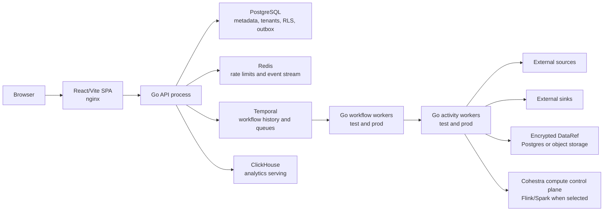

# DataFlow architecture

Updated: 2026-07-10

## Architecture stance

DataFlow is a modular monolith with separately deployable processes. That is the
right shape for the first ten daily users. Splitting control-plane domains into
networked microservices now would add failure modes, deployment work, and
distributed transactions without solving a measured bottleneck.

Boundaries are nevertheless explicit so hot or independently owned domains can
be extracted later. The first extraction candidates are connector workers,
execution dispatch, and analytics—not identity or pipeline CRUD.

## Runtime

One Go module, `apps/workflow-go`, builds three binaries:

- `api`: identity, tenants, catalog, pipeline/version lifecycle, run control,
  monitoring, lineage, analytics, billing, and outbox dispatch.
- `workflow-worker`: deterministic Temporal DAG orchestration. It must not do
  network or database I/O.
- `activity-worker`: connector I/O, payload handling, checkpoints, sink writes,
  and execution bookkeeping.

The processes share code and contracts, but not in-memory state. Temporal task
queues separate Integration (`test`) and Production (`prod`) execution.

## Source tree and ownership

| Path | Responsibility |
| --- | --- |
| `apps/workflow-go/internal/api` | HTTP adapters, auth middleware, tenant boundary, use-case coordination |
| `apps/workflow-go/internal/workflows` | Deterministic workflow state machines |
| `apps/workflow-go/internal/activities` | Temporal activity adapters and execution coordination |
| `apps/workflow-go/internal/connectors` | Connector registry and connector implementations |
| `apps/workflow-go/internal/objectstore` | Encrypted large-payload storage |
| `apps/workflow-go/internal/database` | PostgreSQL pools and tenant transactions |
| `apps/workflow-go/internal/dispatchers` | Transactional-outbox delivery |
| `apps/web/src/pages` | Route-level product features |
| `apps/web/src/components` | Reusable UI and feature components |
| `apps/web/src/context` | Shell-wide auth, catalog, feature, and theme state |
| `packages/shared` | Browser-side pipeline, Mermaid, lineage, and entitlement contracts |
| `db` | Ordered PostgreSQL migrations and RLS policies |
| `connectors/manifests` | Declarative HTTP connector plugins |
| `deploy` | Local Kind/Helm deployment |
| `infra` | GCP demo infrastructure |

## Data ownership and consistency

PostgreSQL is the system of record for tenants, users, pipeline versions,
executions, checkpoints, entitlements, audit events, and transactional outboxes.
Tenant-facing queries must execute through `TenantTx` or an equivalent
tenant-scoped helper so PostgreSQL RLS remains a second boundary.

Temporal owns workflow history, retries, timers, signals, and orchestration
state. Its payload codec uses AES-256-GCM. Production processes fail to start
when `TEMPORAL_PAYLOAD_ENCRYPTION_KEY` is absent.

Redis is not a system of record. It carries rate-limit counters and an event
consumer-group stream. PostgreSQL outbox rows are the durable publication
source. Acknowledged Redis stream entries are deleted; Redis uses AOF and a PVC
in the demo chart.

ClickHouse is a derived analytics store. Rebuild and backup procedures must not
assume it contains authoritative tenant or pipeline state.

Large `DataRef` payloads should use client-side encrypted object storage.
Inline and PostgreSQL payloads are acceptable only under explicit size and
retention limits.

## Backend extraction seams

Keep one repository and one database for now, but enforce these logical domains:

1. Identity and tenancy: users, sessions, invitations, API tokens, roles.
2. Pipeline catalog: immutable definitions, versions, stage, contracts, lineage.
3. Execution control: run/backfill APIs, Temporal start/signal/query, quotas.
4. Connector control: catalog, credential vault, OAuth, connection tests.
5. Data plane: source/sink activities, payloads, cursor and dedupe commits.
6. Operations: monitoring, alerts, audit, OpenLineage.
7. Analytics: ClickHouse datasets, queries, dashboards, sharing.
8. Commercial: usage, orders, entitlements.

Extraction rule: a domain may become a service only after it has typed inputs,
versioned events, no cross-domain table writes, an independent SLO, and a
measured scaling or ownership reason. Connector/data-plane workers can scale
independently today without becoming a service because Temporal queues already
form the boundary.

## Frontend modularity

Routes are lazy-loaded. This gives each feature a bundle boundary without a
micro-frontend runtime. The shell owns routing, auth, theme, navigation, error
boundaries, and the API client.

Target feature packages:

- `features/pipelines`: list, editor, lifecycle, versioning.
- `features/runs`: history, run detail, logs, traces.
- `features/operations`: monitoring, incidents, lineage.
- `features/connectors`: catalog, OAuth, credential instances.
- `features/analytics`: datasets and dashboards.
- `features/admin`: team, profile, settings, billing.
- `ui`: accessible design primitives and tokens.
- `data`: typed API client, query cache, error model.

Do not introduce Module Federation until at least two teams need independent
release cadences. Package boundaries and route chunks preserve that option with
far less operational cost.

## Scale model

“One million DAGs” means one million stored pipeline definitions, not one
million simultaneously running workflows. Capacity plans must state stored
DAGs, active schedules, starts/second, concurrent runs, nodes/run, records/page,
payload bytes, and retention separately.

Current design is suitable for functional demos, not a validated 10K or 1M
catalog. Required progression:

| Stage | Architecture requirement |
| --- | --- |
| 10 users / first pilot | Managed durable stores, server-side pipeline pagination, strict input limits, backup restore drill, seeded onboarding, security gates |
| 10K stored DAGs | Keyset catalog queries, summary projections, indexed filters, worker autoscaling, pooled/batched connectors, retention jobs, load tests |
| 100K stored DAGs | Partitioned execution/audit tables, brokered dispatch, schedule sharding, independent data-plane capacity, SLO-based autoscaling |
| 1M stored DAGs | Partitioned catalog ownership, distributed schedule/start service, multi-region DR choice, isolated tenant quotas, proven Temporal and DB capacity |

Detailed pending work and acceptance criteria live in [ROADMAP.md](ROADMAP.md).
