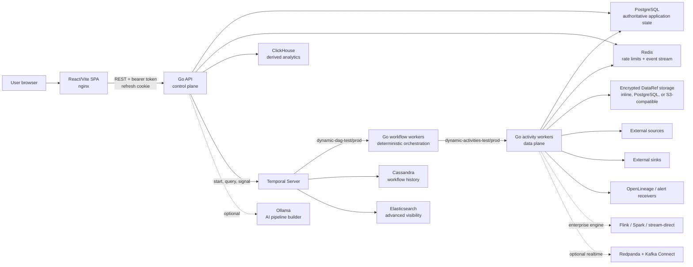
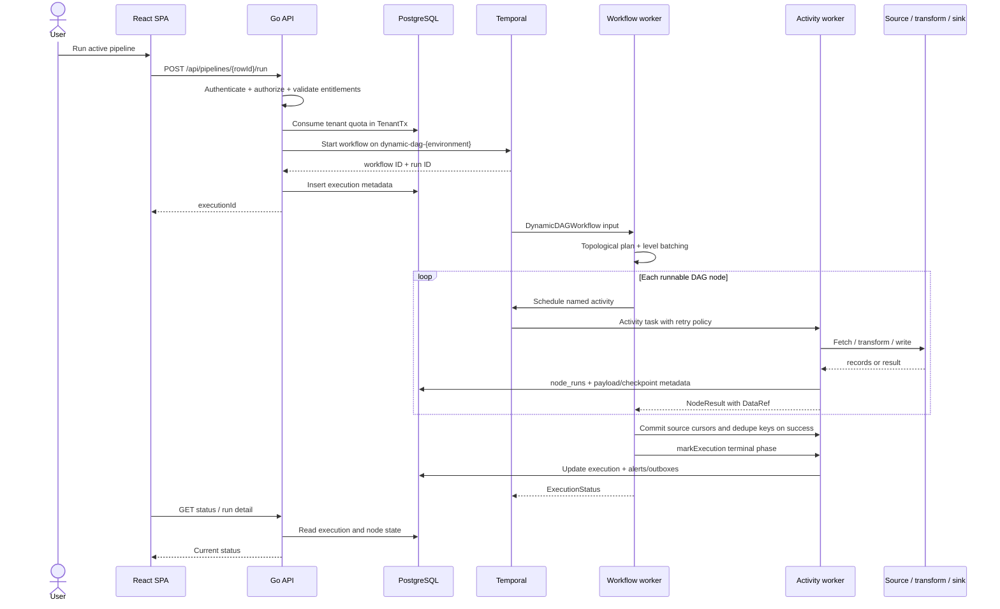
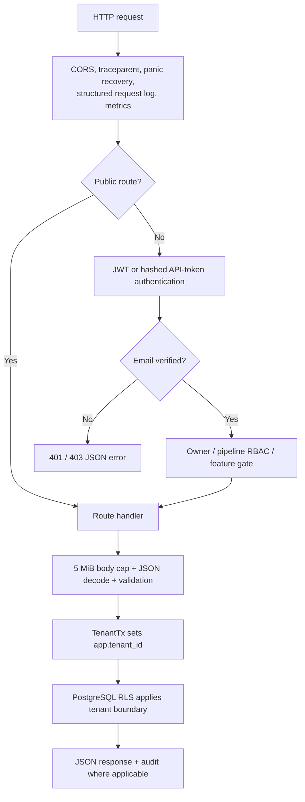
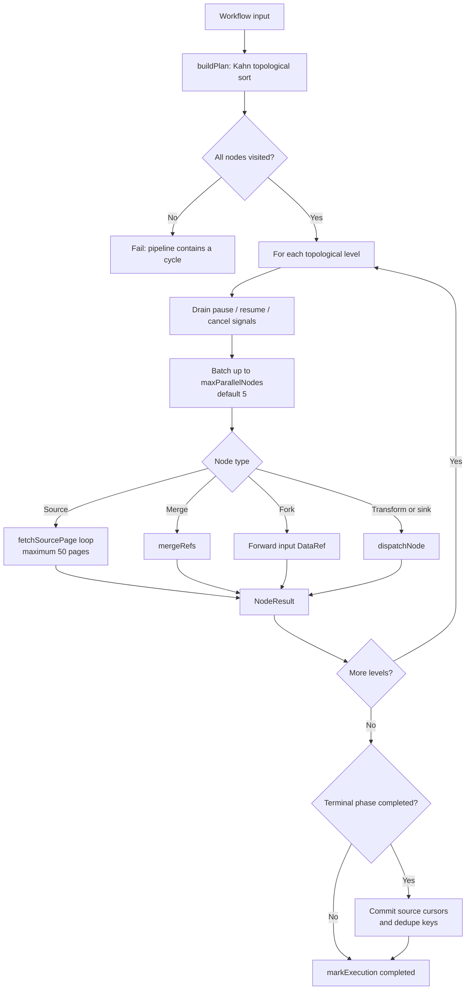
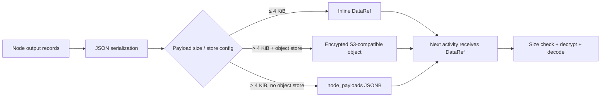
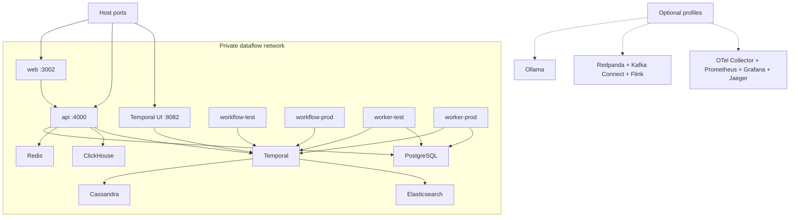

# DataFlow current architecture: HLD and LLD

**Snapshot:** 2026-08-07  
**Repository:** `Cohestra/cohestra-dataflow`  
**Local baseline:** branch `feat/ai-pipeline-builder`, Git HEAD `b09ce901`, plus the M0–M4 working diff documented in the companion AI bake-off page  
**Scope:** the architecture implemented in the current checkout. Optional profiles and enterprise-only paths are labelled explicitly; the AI builder internals and promotion evidence are expanded in the companion document.

## Executive summary

DataFlow is an open-core, multi-tenant **modular monolith with separately deployable processes**. A React/Vite single-page application calls one Go HTTP API. The same Go module builds deterministic Temporal workflow workers and I/O-capable activity workers. Temporal supplies durable DAG orchestration; PostgreSQL is the authoritative application store; Redis carries rate-limit counters and a derived event stream; ClickHouse serves derived analytics; Cassandra and Elasticsearch back Temporal history and visibility; and encrypted `DataRef` objects move records between DAG nodes without embedding large payloads in workflow history.

The main runtime path is:

1. A browser creates, versions, activates, promotes, or runs a pipeline through the Go API.
2. The API validates tenant, role, entitlements, pipeline shape, and quota, then starts a workflow in the `test` or `prod` Temporal namespace.
3. `DynamicDAGWorkflow` topologically sorts the graph into levels, runs independent nodes concurrently, and responds to pause, resume, and cancel signals.
4. Activity workers perform source reads, transformations, merges, sink writes, checkpointing, payload storage, and run bookkeeping.
5. Source cursors and cross-run dedupe keys commit only after the DAG completes successfully.

## High-level design

### Architectural boundaries

| Boundary | Current implementation | Responsibility |
| --- | --- | --- |
| Experience | `apps/web` | Canvas, lifecycle, runs, monitoring, lineage, connectors, analytics, billing, and administration |
| HTTP control plane | `apps/workflow-go/cmd/api` + `internal/api` | Authentication, tenancy, pipeline lifecycle, execution control, connector control, analytics, billing, and background maintenance |
| Orchestration | `cmd/worker` + `internal/workflows` | Deterministic DAG planning, concurrency, signals, retries, and terminal state |
| Data plane | `cmd/activity-worker` + `internal/activities` + `internal/connectors` | External I/O, transforms, payload materialization, checkpoints, dedupe, node metrics, alerts, and outboxes |
| Contracts | `internal/model`, `packages/shared`, `tests/contracts` | Pipeline, execution, `DataRef`, connector manifest, and wire compatibility shapes |
| Persistence | `db`, `internal/database`, `internal/objectstore` | Authoritative metadata, RLS, workflow persistence, analytics projections, and encrypted payloads |
| Deployment | `docker-compose.yml`, `deploy/helm/dataflow`, `infra` | Local Compose, Kubernetes/Helm, and optional GCP reference deployment |

### Process model

One Go module builds three binaries from one Dockerfile:

- `api`: a standard-library HTTP server plus background retention, backfill, and asset-event work.
- `workflow-worker`: registers deterministic workflows and performs no direct database or network I/O.
- `activity-worker`: owns database and external-system I/O, connector pools, payload storage, and outbox dispatchers.

The processes share code and serialized contracts but **do not share memory**. Integration and Production are isolated by Temporal namespaces and task queues:

| Environment | Workflow queue | Activity queue |
| --- | --- | --- |
| Integration | `dynamic-dag-test` | `dynamic-activities-test` |
| Production | `dynamic-dag-prod` | `dynamic-activities-prod` |

## End-to-end control flow

### Trigger variants

- **Manual run:** `pipelineRun` calls `fireExecution` immediately.
- **Cron:** activation creates a Temporal Schedule. At firing time the workflow first calls `prepareScheduledExecution` to enforce quota and create the execution row.
- **Backfill:** the API persists a job and partitions; a background dispatcher starts partitions subject to configured concurrency.
- **Webhook / upstream / asset materialized:** public trigger routes or the durable pipeline-event outbox resolve matching active consumers and start executions within the same tenant and environment.
- **Retry:** creates a new execution linked through `retry_of`; it does not mutate completed workflow history.

## Low-level design

### API request path

Key rules:

- Access JWTs are HS256 and expire after 15 minutes; refresh tokens are stored hashed and returned as an HttpOnly cookie scoped to `/api/auth`.
- API tokens are stored as SHA-256 hashes and checked for revocation and expiry.
- Protected handlers receive a `TenantContext`; tenant-facing database work uses `TenantTx`, which sets `app.tenant_id` for RLS.
- Pipeline-level roles are `viewer`, `editor`, and `admin`; workspace owners bypass per-pipeline grants.
- Enterprise capabilities are build- and tenant-entitlement-gated.
- Tenant-supplied HTTP endpoints use an HTTPS-only, SSRF-protected client that revalidates resolved IPs.

### Pipeline lifecycle

1. `POST /api/pipelines` validates identifiers, graph structure, size limits, and feature use.
2. The API inserts a new immutable version in `pipelines`; it does not overwrite an earlier definition.
3. Activation archives the previous active version in that environment, marks the selected version active, and synchronizes its cron schedule if needed.
4. Promotion and stage transitions compare contracts and enforce Integration/Production gates.
5. Execution pins the selected persisted pipeline row and version, so later edits do not alter a running DAG.

### DAG planning and node execution

Planning and execution semantics:

- `buildPlan` validates edge endpoints, computes incoming/outgoing edges, and detects cycles using Kahn's algorithm.
- Nodes in a topological level run concurrently in bounded batches; levels run sequentially.
- A node with inbound edges is skipped when no upstream node succeeded.
- Conditional edges call `evalEdgeCondition` against the upstream `DataRef`; a false condition skips the node.
- Source nodes page until `HasMore` is false, then concatenate page references. The 50-page bound limits workflow history and payload growth.
- Merge nodes support configured merge strategies. Oversized non-concat merges fail before exhausting memory; oversized concat can spill through a temporary file path.
- Activity failures become failed `NodeResult` values. Temporal retries activity errors up to five attempts with exponential backoff, except named non-retryable validation/quota errors.
- Pause and cancel take effect at orchestration boundaries; status is exposed through the Temporal `status` query.

### Connector runtime

The activity worker constructs one `connectors.Runtime` and registers handlers by category:

- transforms;
- HTTP and webhook connectors;
- databases;
- files and object stores;
- streams;
- SaaS connectors.

Compiled connectors are selected by `activityType`. Declarative HTTP connector manifests mounted from `connectors/manifests` extend source behavior without rebuilding the image. Saved connector instances keep reusable configuration and encrypted secrets separate from pipeline definitions. Ownership is checked again inside activities before external I/O.

### Payload and checkpoint model

`DataRef` is the data-plane handoff contract. It includes storage type, key, tenant, size, record count, encryption metadata, and optional bucket. The encryption key is the execution DEK when present, otherwise the platform key. Large object-store payloads require encryption. A configured maximum payload size is enforced before reads.

Incremental source state is kept in `connector_state`. A source returns a candidate checkpoint in its `NodeResult`; the workflow commits checkpoints only after the full DAG succeeds. Pipeline-scoped dedupe follows the same commit-after-success rule. This gives failed executions replay behavior without advancing the durable cursor.

### Storage ownership

| Store | Authoritative data | Derived / operational data | Notes |
| --- | --- | --- | --- |
| PostgreSQL | tenants, users, pipeline versions, executions, connector instances, credentials, checkpoints, entitlements, RBAC, audit | node runs, quality results, alerts, outboxes, materializations, dashboards | Application system of record; API uses RLS-scoped role |
| Temporal + Cassandra | workflow event history, timers, retries, signals | current orchestration state reconstructed from history | Cassandra is Temporal persistence, not an application query store |
| Elasticsearch | none | Temporal advanced visibility and Temporal UI search | Loss affects visibility, not authoritative application metadata |
| Redis | none | rate-limit buckets and `dataflow:pipeline-events` consumer stream | PostgreSQL outbox remains durable publication source |
| ClickHouse | none | sink records and execution/analytics metrics | Rebuildable derived analytics serving store |
| S3-compatible object storage | encrypted large node payloads when configured | execution intermediates | `DataRef` points to ciphertext; retention is separate from workflow history |

### Core PostgreSQL aggregates

| Domain | Main tables |
| --- | --- |
| Identity and tenancy | `tenants`, `users`, `refresh_tokens`, `email_verifications`, `user_invitations`, `api_tokens`, `audit_log` |
| Pipeline catalog | `pipelines`, `pipeline_access`, lineage and materialization tables |
| Execution control | `executions`, `node_runs`, `backfill_jobs`, `backfill_partitions`, `execution_retries` |
| Data plane state | `connector_instances`, `oauth_connections`, `connector_state`, `node_payloads`, `dedupe_keys` |
| Reliability and governance | `data_quality_results`, `pipeline_alerts`, event/alert/OpenLineage outboxes, external lineage events |
| Commercial and product | `billing_plans`, `usage_counters`, `payment_orders`, `tenant_feature_entitlements`, `dashboards`, `dashboard_shares` |

## Deployment topology

The default Docker Compose profile starts PostgreSQL, Redis, ClickHouse, Cassandra, Elasticsearch, Temporal, Temporal UI, the API, two activity-worker pools, two workflow-worker pools, and the web container on one private bridge network.

Kubernetes/Helm preserves the same logical boundaries. Workers can scale independently because task queues are already the process boundary; splitting them into networked microservices is not required for independent capacity.

## Reliability, consistency, and failure behavior

- **Workflow durability:** Temporal replays deterministic workflow code from Cassandra-backed history after process restarts.
- **Activity retries:** five attempts, exponential backoff from 2 seconds to 5 minutes, 10-minute start-to-close timeout, and 1-minute heartbeat timeout.
- **State commit:** execution row insertion is paired with workflow start compensation; if metadata insertion fails, the API terminates the just-started workflow and releases quota.
- **Cursor safety:** source cursors and cross-run dedupe keys advance only after successful DAG completion.
- **Outbox delivery:** pipeline events, alerts, and OpenLineage events originate in PostgreSQL and are dispatched with row locking, bounded batches, retry tracking, and exponential delay.
- **Tenant isolation:** authentication + tenant context + application checks + PostgreSQL RLS form layered boundaries. Activity workers use a more privileged database role for system-level cross-tenant work.
- **Payload safety:** workflow payload codec and `DataRef` payloads use AES-256-GCM when keys are configured; production is expected to require the key.
- **Observability:** JSON logs, Prometheus HTTP metrics, traceparent propagation, node-run metrics, execution traces, optional OpenTelemetry/Jaeger, monitoring views, alerts, and OpenLineage.

## Optional and enterprise paths

These are present in the code or deployment configuration but are not part of the default community execution path:

- Ollama-backed AI generate/refine routes (`--profile ai`).
- Redpanda, Kafka Connect, and Flink containers (`--profile realtime` or `cdc`).
- OpenTelemetry Collector, Prometheus, Grafana, and Jaeger (`--profile observability`).
- Enterprise workflow/activity registrations for `stream-direct`, `spark-sql`, and `flink-sql`; availability also depends on the enterprise build and tenant entitlements.

## Current architectural constraints

- This is a pre-release architecture intended for evaluation and controlled pilots; high availability and capacity are deployment-dependent and not established merely by the code paths.
- The default Compose topology is single-instance and development-oriented.
- The workflow executes a materialized, levelized DAG; it is not a general unbounded streaming graph in the default path.
- Node payloads are JSON values and many transforms materialize their input; size guards and the concat spill path reduce risk but do not make all operations streaming.
- Redis and ClickHouse are derived stores. Recovery procedures must rebuild from authoritative sources instead of treating them as the source of truth.
- Separate task queues provide independent worker scaling, but scale limits must be validated with workload dimensions such as concurrent runs, nodes per run, records per page, and payload bytes.

## Source map

The following files are the primary evidence for this document:

- [`docs/ARCHITECTURE.md`](https://github.com/Cohestra/cohestra-dataflow/blob/05582a21/docs/ARCHITECTURE.md) — existing architectural stance, ownership, and scale model.
- [`apps/workflow-go/cmd/api/main.go`](https://github.com/Cohestra/cohestra-dataflow/blob/05582a21/apps/workflow-go/cmd/api/main.go) — API process entry point.
- [`apps/workflow-go/cmd/worker/main.go`](https://github.com/Cohestra/cohestra-dataflow/blob/05582a21/apps/workflow-go/cmd/worker/main.go) — workflow-worker entry point and registration.
- [`apps/workflow-go/cmd/activity-worker/main.go`](https://github.com/Cohestra/cohestra-dataflow/blob/05582a21/apps/workflow-go/cmd/activity-worker/main.go) — activity-worker construction, connector runtime, and dispatchers.
- [`apps/workflow-go/internal/api/server.go`](https://github.com/Cohestra/cohestra-dataflow/blob/05582a21/apps/workflow-go/internal/api/server.go) — server dependencies, route groups, middleware composition, and background work.
- [`apps/workflow-go/internal/api/auth.go`](https://github.com/Cohestra/cohestra-dataflow/blob/05582a21/apps/workflow-go/internal/api/auth.go) — JWT/API-token authentication and authorization.
- [`apps/workflow-go/internal/api/temporal.go`](https://github.com/Cohestra/cohestra-dataflow/blob/05582a21/apps/workflow-go/internal/api/temporal.go) — quota, workflow start, compensation, and schedules.
- [`apps/workflow-go/internal/api/routes_pipelines.go`](https://github.com/Cohestra/cohestra-dataflow/blob/05582a21/apps/workflow-go/internal/api/routes_pipelines.go) — pipeline lifecycle and run routes.
- [`apps/workflow-go/internal/workflows/dynamic_dag.go`](https://github.com/Cohestra/cohestra-dataflow/blob/05582a21/apps/workflow-go/internal/workflows/dynamic_dag.go) — DAG planning, signals, node dispatch, paging, and checkpoint commits.
- [`apps/workflow-go/internal/activities/activities.go`](https://github.com/Cohestra/cohestra-dataflow/blob/05582a21/apps/workflow-go/internal/activities/activities.go) — activity implementations and execution bookkeeping.
- [`apps/workflow-go/internal/activities/payloads.go`](https://github.com/Cohestra/cohestra-dataflow/blob/05582a21/apps/workflow-go/internal/activities/payloads.go) — `DataRef` placement, encryption, limits, and reads.
- [`apps/workflow-go/internal/connectors/runtime.go`](https://github.com/Cohestra/cohestra-dataflow/blob/05582a21/apps/workflow-go/internal/connectors/runtime.go) — connector registration and dispatch.
- [`apps/workflow-go/internal/dispatchers/dispatchers.go`](https://github.com/Cohestra/cohestra-dataflow/blob/05582a21/apps/workflow-go/internal/dispatchers/dispatchers.go) — event, alert, and OpenLineage outboxes.
- [`apps/workflow-go/internal/database/database.go`](https://github.com/Cohestra/cohestra-dataflow/blob/05582a21/apps/workflow-go/internal/database/database.go) and [`db/003_rls.sql`](https://github.com/Cohestra/cohestra-dataflow/blob/05582a21/db/003_rls.sql) — tenant transactions and RLS.
- [`apps/web/src/App.tsx`](https://github.com/Cohestra/cohestra-dataflow/blob/05582a21/apps/web/src/App.tsx) and [`apps/web/src/api.ts`](https://github.com/Cohestra/cohestra-dataflow/blob/05582a21/apps/web/src/api.ts) — frontend route and API-client boundaries.
- [`docker-compose.yml`](https://github.com/Cohestra/cohestra-dataflow/blob/05582a21/docker-compose.yml) — concrete local runtime topology and optional profiles.
- [`docs/ADR-002-GO-BACKEND.md`](https://github.com/Cohestra/cohestra-dataflow/blob/05582a21/docs/ADR-002-GO-BACKEND.md) — accepted backend ownership decision.
- [`tests/contracts/backend-wire.json`](https://github.com/Cohestra/cohestra-dataflow/blob/05582a21/tests/contracts/backend-wire.json) — frozen HTTP/Temporal wire examples.

## Maintenance rule

Update this document when process boundaries, task-queue names, workflow/activity names, storage ownership, authentication/tenant boundaries, payload placement, or deployment topology changes. Ordinary endpoint or connector additions should update their focused references instead of expanding this page into an API catalog.
