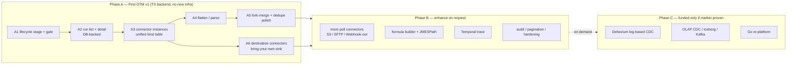

# Product Roadmap — First GTM (handful of users), then enhance on request

> Backend ownership changed on 2026-07-01: API, activities, connectors, and
> object storage now live in `apps/workflow-go`. Legacy TypeScript paths below
> describe the pre-ADR-002 baseline.

> **Historical plan:** implementation has moved beyond this GTM snapshot (CDC,
> durable events/incidents, pagination, retries, and workspace lineage now ship).
> Use [`ENTERPRISE_ROADMAP.md`](./ENTERPRISE_ROADMAP.md) for current priorities.

> **Status:** Pre-production. No public users, no data to migrate, no compat burden.
> **Goal of this roadmap:** ship a credible v1 to a small invited group on the **existing TS backend**,
> learn from real use, then build depth only when a user asks for it.

## Operating principle

Build the happy path that demos and onboards a handful of users. Skip durability, scale, migration,
and audit work until the feature it protects is actually exposed. Every "later" item below is real —
it just doesn't block first GTM.

**Explicitly NOT doing for v1** (deferred to "on request"):

- **Go re-platform (old Phase G).** The TS backend works. Rewriting it builds zero user-visible value
  and gates everything behind months of risk. The Go `workflow-go` interpreter already exists and stays;
  that's the only Go we need. Revisit only if a profiler names a real bottleneck — not on spec.
- **Debezium / log-based CDC.** Kafka + Kafka-Connect + schema-registry + offset mgmt + ingestion bridge.
  Largest single cost in the program. Its own funded project, not a v1 line-item.
- **Temporal trace proxy**, OLAP/Iceberg CDC, JMESPath select dep, no-code formula/macro engine, audit
  tables, pagination, dual-write reliability hardening. All post-launch, demand-driven.

## Temporal 2026 feature decisions

Reviewed July 2026 against the [Temporal platform changelog](https://temporal.io/changelog).
New Temporal capabilities do not expand the GTM product surface:

- **Adopt Task Queue Priority and Fairness after the Server 1.31 upgrade.** Use `tenantId` as the
  fairness key so a large tenant cannot starve others. Keep priority internal: interactive/test runs `2`,
  scheduled runs `3`, backfills `4`. Do not add scheduling controls to the MVP UI.
- **Migrate to Worker Deployment Version APIs before Server 1.32.** This replaces the deprecated
  Build-ID compatibility API and is operational maintenance, not a new product feature.
- **Keep long-lived workers for GTM.** [Serverless Workers](https://docs.temporal.io/serverless-workers)
  are pre-release, AWS Lambda-only, and a poor fit for VPC-bound connectors, CDC, and long backfills.
- **Defer Standalone Activities and Workflow Streams.** Existing connector tests are simpler as direct
  calls; normal pipelines still need Workflow-level durability. Streams have no validated customer need.
- **Do not duplicate payload storage.** Temporal External Storage is public preview; retain the existing
  encrypted `DataRef` path until Temporal support is stable across both Go and TypeScript workers and can
  replace that path end to end.

Current version and migration work lives in [`ENTERPRISE_ROADMAP.md`](./ENTERPRISE_ROADMAP.md).

---

## Current architecture (verified — unchanged, still TS backend + Go interpreter)

| Layer | Where | Notes |
| --- | --- | --- |
| Pipeline model | `packages/shared/src/types.ts` | Versioned, immutable per edit. Edge `condition?` exists (`types.ts:50`). |
| Status / env | `db/001_init.sql`, `db/008_environments.sql` | Promotion already built; one-active-version-per-(key,env). |
| Triggers | `types.ts` `TriggerConfig` = `cron` \| `webhook` (HMAC) \| `event` | Webhook + event triggers already exist. |
| Execution record | `db/001_init.sql` (`executions`, `node_runs`), `db/009_*.sql` | `node_runs` has single `record_count`/node + status/duration/error. |
| Workflow engine | `apps/workflow-go/internal/workflows/dynamic_dag.go` | **Go.** Kahn topo sort, fork fan-out, `mergeRefs`, pause/resume/cancel. Stays. |
| Activities | `apps/worker/src/activities/` | **TS.** `mergeRefs` (innerJoin+concat), transform handlers (map/filter/rename/dedupe). |
| Connector SDK | `packages/connector-sdk/src/` | **TS.** Manifests (REST poll) + coded plugins; `SourceFn` + durable cursor. |
| Connector mgmt | `apps/api/src/routes/connectors.ts`, `oauth_connections`, `apps/web/.../ConnectorsPage.tsx` | OAuth only today: CSRF state, upsert, getLiveToken, list/delete/refresh, catalog. Tokens encrypted. |
| Expression engine | `packages/shared/src/safe-expression.ts` | Secure predicate/map eval; literals + `r.`/`records.` only; no call syntax (deliberate). |
| Validation | `apps/api/src/lib/validatePipeline.ts` | Expression validation + acyclic DAG check. |
| API service | `apps/api` — Express/TS | routes: ai, analytics, auth, billing, connectors, edition, executions, pipelines, team, triggers. |
| Web | `apps/web` — React, ReactFlow, Tailwind `glass-*` | Stays TS. |

**Already baseline:** fork = engine fan-out; merge = `mergeRefs`; dedupe = single-key Set. Expose/extend, don't rebuild.

---

## Phase A — First GTM v1 (the only committed phase)

Everything here is on the **TS backend**, no new infra. Target: invite ~5–10 users, give them a tool that
looks and behaves like a real pipeline product end to end.

### A1 — Lifecycle stage + promotion gate

Don't add a `stage` enum — derive it from the `status` + `environment` you already have:
`draft` = draft/test · `testing` = active/test · `production` = active/prod.

- `POST /pipelines/:id/stage` runs the transitions over existing promotion machinery.
- **The gate is the feature:** `testing → production` requires ≥1 successful test-env run of the current
  version, else 409. This is the trust moment in a demo.
- `LifecyclePage.tsx` + stage badge on canvas.
- Skip the `pipeline_stage_transitions` audit table — no auditors yet. Add on request.

Touches: `apps/api/src/routes/pipelines.ts` (transition + gate), `apps/web` (page, badge, nav).

### A2 — Run history & observability (DB-backed only)

A pipeline tool with no run history looks broken on first open. This is the core product surface.

- **Run list:** filters (pipeline, env, status, time) + a `limit` on existing `GET /executions`.
  Skip pagination — you'll have a dozen runs, not thousands.
- **Run detail:** `GET /executions/:id` → render the DAG on the ReactFlow canvas you already have,
  per-node status / `record_count` / duration / error. Edge labels show downstream-in = upstream-out
  derived from adjacent node records.
- **Defer the Temporal trace proxy** (decrypt/redact encrypted history) — build when a user hits a failure
  the node_runs data can't explain.

Touches: `apps/api/src/routes/executions.ts`, new `RunsPage.tsx` + `RunDetailPage.tsx`, nav/routes.
Reuse the existing ~1.5s live-run polling; stop on terminal phase.

### A3 — Connector instances (so the demo isn't "edit JSON in a node")

Generalize OAuth-only management into reusable instances of any kind.

- **One `connector_instances` table with a `kind` column** — OAuth is one kind. No parallel table, no
  reconciliation (nothing to reconcile pre-prod — just design it right once).
- Reuse `encryptToken`/`decryptToken`, the existing `ConnectorsPage`/`components/connectors` UI, and
  `GET /connectors/catalog`.
- Add only: non-OAuth credential instances (DB/host/key), `POST /connectors/:id/test` (test-connection),
  and node → instance referencing (nodes point at an instance id instead of inline config).
- **Instance-picker in node config is required (not deferred)** — A6 destinations depend on it.

Touches: `db/010_connector_instances.sql`, `apps/api/src/routes/connectors.ts`, web connector pages +
node config in `PipelineCanvasPage.tsx`.

### A4 — Transforms: flatten / parse

Real ETL credibility, cheap coded handlers in the existing TS activities.

- `transform.flatten` — nested object → dot-notation (delimiter, max depth, array policy).
- `transform.parse` — parse stringified JSON fields (fields, onError=skip/fail/null).
- **Defer** JMESPath `select` (overlaps existing map; add a dep only on request) and the no-code
  formula/macro layer (real grammar + security work; impressive but not needed to look real).

Touches: `apps/worker/src/activities/catalog.ts`, `apps/web/src/catalog.ts` + server catalog, validation.

### A5 — Fork/merge + dedupe polish (engine already supports it)

- Validation: fork ≥2 out-edges, merge ≥2 in-edges (`validatePipeline.ts`).
- More merge strategies in `mergeRefs` (`union`, `leftJoin`, `outerJoin`, `appendWithSourceTag` —
  extending innerJoin+concat at `activities/index.ts:185`).
- Conditional fork via the per-edge `condition` that already exists (`types.ts:50`) — expose as branch routing.
- Dedupe: compound keys (array → composite hash), `keep: first|last`. Defer cross-run dedupe (durable store)
  until a user needs it. Palette polish in `PipelineCanvasPage.tsx`.

### A6 — Destination (sink) connectors: bring-your-own destination

**Gap (GTM-blocking):** today sinks are hardcoded to *our* storage — `sink.records` (→ ClickHouse),
`sink.postgres` (alias of the same), `sink.webhook` (arbitrary URL). That is not an IPaaS. Hevo /
Fivetran / Airbyte are **source connector → transform → destination connector**, where the destination
is a system the *user owns* (their Postgres, their Google Sheet, their warehouse). Sinks must become
connectors, symmetric to sources, selected by a connector instance (A3).

**Design — make sinks symmetric to sources, reusing A3 instances + the connector SDK:**

- **Sinks are connector `Handler`s** (the SDK already unifies sink+transform under one `Handler` type via
  `registry.getHandlers()` — no separate `SinkFn` contract is needed). Each destination handler resolves
  the referenced **connector instance** from `ctx.tenantId` + `config.connectionId`, decrypts its creds
  (`loadCredentialInstance` for credential kinds, `getOAuthConnection` for OAuth), and writes. Mirrors how
  coded sources resolve an instance today.
  - *Current state:* the Phase-A destinations are coded handlers in `apps/worker/src/activities/catalog.ts`.
    Promoting them to manifest-driven plugins (so third parties add a destination with no core edit) is a
    Phase-B follow-up, not required for GTM.
- **Phase A destination set (minimal, symmetric to the sources we already ship):**
  - **Postgres destination** (BYO DB) — upsert records into a user table (config: table, conflict key;
    creds from a `postgres` credential instance). This replaces the internal `sink.postgres` alias.
  - **Google Sheets destination** — append/replace rows (config: spreadsheet/sheet; OAuth instance) —
    the write-side twin of the existing `gsheets.fetch` source.
  - **Webhook destination** — keep existing `sink.webhook`; optionally bind a stored-secret instance for HMAC.
  - **DataFlow managed store** (`sink.records` → ClickHouse) — keep as one *optional* built-in destination
    (it powers Analytics), but **BYO is the default**, not the only option.
- **Node config:** sink nodes use the A3 **instance-picker** to choose the destination instance, plus
  destination-specific fields (table / sheet / url). Validation: a sink node must reference an instance.

**Touches (Go-free, TS):** `packages/connector-sdk/src/` (SinkFn + registry sinks), new sink plugins
(postgres, gsheets) beside `apps/worker/src/activities/connectors/`, generic sink dispatch in
`apps/worker/src/activities/`, `apps/web/src/catalog.ts` + server catalog (sink entries → instance-picker
+ dest fields), `validatePipeline.ts`, sink node config in `PipelineCanvasPage.tsx`.

**GTM:** "connect a source, pick where the data lands" is the whole IPaaS promise. Without BYO
destinations the product only fills our own store — not sellable. This is the missing half of A3.

---

## Phase B — Enhance on request (backlog, not committed)

> **Implemented July 2026:** SFTP source/sink, safe formulas, per-record JMESPath select,
> redacted Temporal history, cross-run dedupe, audit export, and paged execution history.

Pull any item into a sprint only when an invited user actually asks. Rough order of likelihood:

- **More poll-source connectors** (manifests — cheapest breadth) and **S3 / SFTP / Webhook-out** sources/sinks
  (S3-notification + inbound webhook reuse the `webhook`/`event` triggers you already have).
- **F4 no-code formula builder** + whitelisted-call layer on `safe-expression` (with dedicated security tests).
- **JMESPath `transform.select`.**
- **Temporal trace surfacing** (history proxy, tenant-safe decrypt/redact).
- **Cross-run dedupe** (durable content-hash store, reuse `connector_state` pattern).
- **Audit log, pagination, dual-write hardening** — the production-durability pass, done the sprint before
  you open beyond the handful.

## Phase C — Funded projects (only if GTM proves the market)

> **Implemented July 2026:** Debezium CDC, Kafka source/sink, Snowflake cursor/CHANGES ingestion
> plus destination writes, and append-snapshot Iceberg REST ingestion. The Go re-platform remains
> conditional on a measured runtime bottleneck.

- **Log-based CDC (Debezium):** Kafka + Connect + schema-registry + offset/history + ingestion bridge +
  streaming-consumer trigger. Scope as its own project. Batch-fire executions for v1 of it; true streaming later.
- **OLAP CDC** (Snowflake streams), **Iceberg incremental snapshots**, **Kafka message-stream** source/sink.
- **Go re-platform** — only if a real bottleneck or the CDC streaming runtime genuinely demands one language.
  Pre-prod is the cheapest moment to do it (no migration), but it buys zero GTM value, so it waits.

---

## Verification (per shipped A-item)

1. `docker-compose up` (Postgres, ClickHouse, Temporal — no Kafka/Debezium in Phase A); apply new `db/*.sql`.
2. Start TS API + worker + workflow-go + `apps/web`.
3. Exercise via curl:
   - A1: `POST /pipelines/:id/stage`; assert gate 409 with no green test run, 200 after.
   - A2: trigger a run; `GET /executions`, `GET /executions/:id`; assert phase + per-node counts + edge-derived in/out.
   - A3: `POST /connectors` (instance) + `POST /connectors/:id/test`; build a pipeline referencing it; run.
   - A4: pipeline with flatten/parse nodes; run; assert transformed records.
   - A5: fork→merge + compound dedupe; assert merged + deduped counts.
   - A6: add a Postgres **destination** instance; build source→transform→sink(Postgres) referencing it;
     run; assert rows land in the *user's* table (not our store). Repeat with a Google Sheets destination.
4. Existing vitest suites + `safe-expression` tests stay green.

## What this revamp deleted vs. the old roadmap

- **Phase G (full TS→Go rewrite)** — removed as a gate; pushed to Phase C, conditional.
- **CDC / Debezium / OLAP / Iceberg / Kafka** — moved out of committed scope into Phase C.
- **`stage` enum, audit table, pagination, Temporal trace, JMESPath dep, formula engine** — deferred to B.
- **All migration / compat / proxy-cutover / wire-compat risk** — gone; pre-prod has nothing to migrate.

Net: a multi-quarter rewrite-gated program becomes ~one focused build of features a handful of users can
see and try, on the backend you already have.
